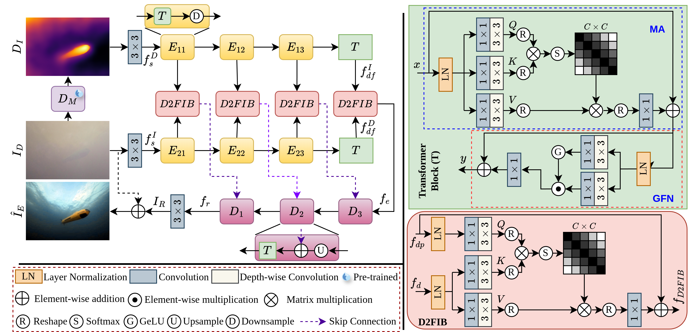

# [River-GEM: Generating and Enhancing Muddy Water Images](https://ieeexplore.ieee.org/document/10887847)

This paper has been accepted in ICASSP 2025



The checkpoint and dataset are available in this [link](https://drive.google.com/drive/folders/1IVHIOA5vetXzmS-TNSw8PMQIjLeak88v?usp=drive_link).

Requirements are given below.
```
Python 3.5.2
Pytorch '1.0.1.post2'
torchvision 0.2.2
opencv 4.0.0
scipy 1.2.1
numpy 1.16.2
tqdm
```

### Training
- Use the below command for training:
```
python train.py --checkpoints_dir --batch_size --learning_rate             
```
### Testing
- Use the below command for testing:
```
python test.py  
```

### Citation
```
@inproceedings{pramanick2025river,
  title={River-GEM: Generating and Enhancing Muddy Water Images},
  author={Pramanick, Alik and Satwik, Chivukula Sairam and Kumar, Sonal and Daydar, Akshay and Sur, Arijit},
  booktitle={ICASSP 2025-2025 IEEE International Conference on Acoustics, Speech and Signal Processing (ICASSP)},
  pages={1--5},
  year={2025},
  organization={IEEE}
}
```
